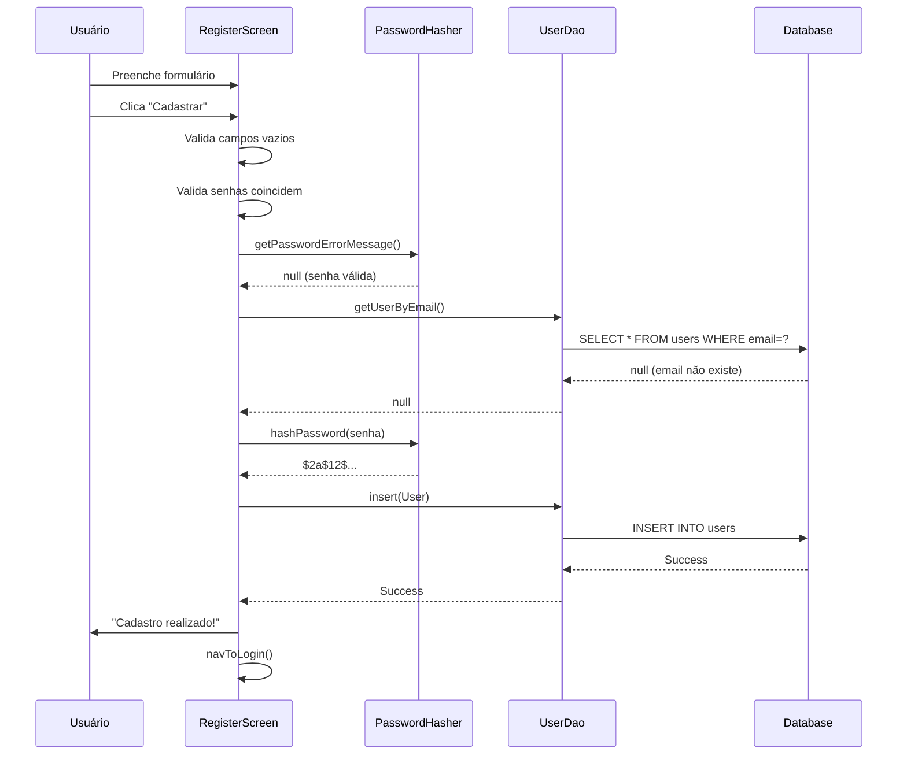
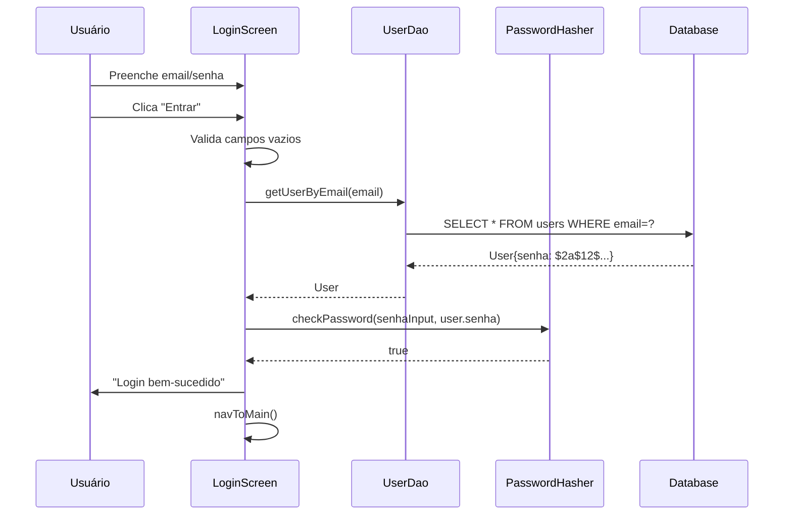
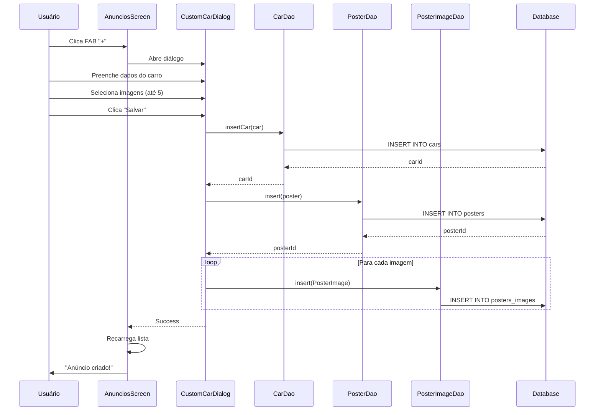
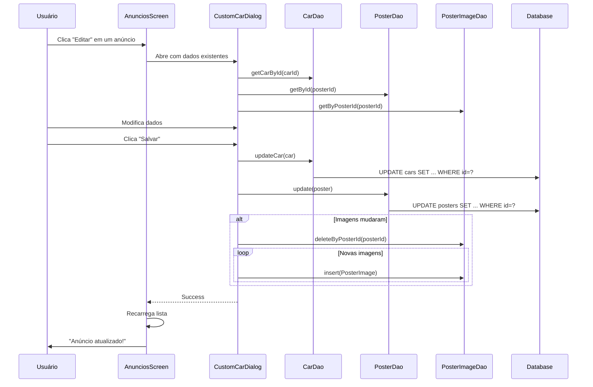
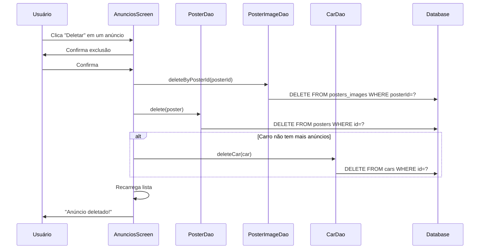
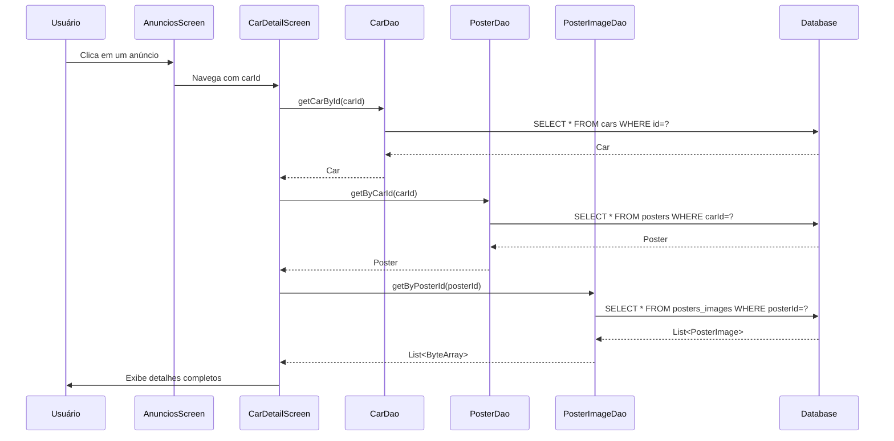
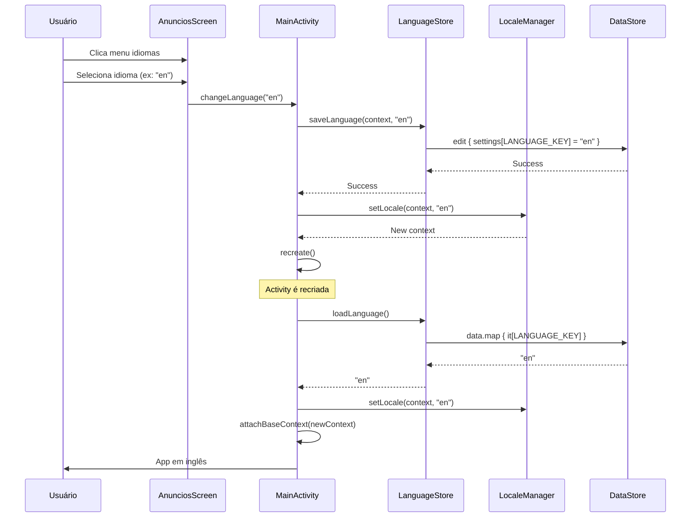

# 📖 Documentação Técnica Completa - Código LuxCar

## 📋 Índice

1. [Visão Geral](#visão-geral)
2. [Arquitetura](#arquitetura)
3. [Camada de Dados](#camada-de-dados)
4. [Camada de UI](#camada-de-ui)
5. [Utilitários](#utilitários)
6. [Fluxos de Negócio](#fluxos-de-negócio)
7. [Referência de APIs](#referência-de-apis)

---

## 🎯 Visão Geral

**LuxCar** é uma aplicação Android para marketplace de veículos de luxo desenvolvida em Kotlin com Jetpack Compose.

### Tecnologias Principais
- **Linguagem:** Kotlin 100%
- **UI:** Jetpack Compose + Material Design 3
- **Persistência:** Room Database
- **Segurança:** BCrypt (hash de senhas)
- **Armazenamento:** DataStore Preferences
- **Concorrência:** Kotlin Coroutines

---

## 🏗️ Arquitetura

### Padrão Arquitetural
```
┌─────────────────────────────────────┐
│         UI Layer (Compose)          │
│  LoginScreen, RegisterScreen, etc.  │
└──────────────┬──────────────────────┘
               │
┌──────────────▼──────────────────────┐
│       Data Layer (Room)              │
│  DAOs, Entities, DatabaseBuilder    │
└──────────────┬──────────────────────┘
               │
┌──────────────▼──────────────────────┐
│    Persistence (SQLite)              │
│         luxcar.db                    │
└──────────────────────────────────────┘
```

### Estrutura de Pacotes
```
com.example.luxcar/
├── data/
│   ├── database/      # Room Database, DAOs
│   ├── model/         # Entidades (Car, Poster, User)
│   └── LanguageStore.kt
├── ui/
│   ├── screens/       # Telas Compose
│   └── theme/         # Cores, tipografia
├── utils/
│   ├── LocaleManager.kt
│   └── PasswordHasher.kt
└── MainActivity.kt
```

---

## 💾 Camada de Dados

### 1. Modelos de Dados (Entities)

#### 🚗 **Car (Carro)**

```kotlin
@Entity(tableName = "cars")
data class Car (
    @PrimaryKey(autoGenerate = true) 
    val id: Long = 0L,
    val marca: String,
    val modelo: String,
    val cor: String,
    val ano: Int,
    val kilometragem: Double,
    val combustivel: String,
    val categoria: String,
    val acessorios: List<String>
)
```

**Descrição dos Campos:**

| Campo | Tipo | Descrição | Exemplo |
|-------|------|-----------|---------|
| `id` | Long | Identificador único (auto-incremento) | 1 |
| `marca` | String | Fabricante do veículo | "Toyota" |
| `modelo` | String | Modelo do veículo | "Corolla" |
| `cor` | String | Cor do veículo | "Preto" |
| `ano` | Int | Ano de fabricação | 2023 |
| `kilometragem` | Double | Quilômetros rodados | 15000.0 |
| `combustivel` | String | Tipo de combustível | "Flex" |
| `categoria` | String | Categoria do veículo | "Sedan" |
| `acessorios` | List<String> | Lista de acessórios | ["Airbag", "ABS"] |

**TypeConverter:**
```kotlin
class Converters {
    // Converte List<String> para String separada por vírgulas
    @TypeConverter
    fun fromList(list: List<String>): String = 
        list.joinToString(",")
    
    // Converte String separada por vírgulas para List<String>
    @TypeConverter
    fun toList(data: String): List<String> =
        if(data.isEmpty()) emptyList() else data.split(",")
}
```

**Uso no Banco:**
- Lista ["Airbag", "ABS", "Ar-condicionado"] → String "Airbag,ABS,Ar-condicionado"
- Armazenado como TEXT no SQLite

---

#### 📢 **Poster (Anúncio)**

```kotlin
@Entity(
    tableName = "posters",
    foreignKeys = [
        ForeignKey(
            entity = Car::class,
            parentColumns = ["id"],
            childColumns = ["carId"],
            onDelete = ForeignKey.CASCADE
        )
    ],
    indices = [Index(value = ["carId"])]
)
data class Poster(
    @PrimaryKey(autoGenerate = true) 
    val id: Long = 0L,
    val titulo: String,
    val descricao: String,
    val preco: Double,
    val imagem: ByteArray,
    val carId: Long,
    val emNegociacao: Boolean = false
)
```

**Descrição dos Campos:**

| Campo | Tipo | Descrição | Exemplo |
|-------|------|-----------|---------|
| `id` | Long | Identificador único | 1 |
| `titulo` | String | Título do anúncio | "Corolla 2023 Impecável" |
| `descricao` | String | Descrição detalhada | "Único dono, revisões..." |
| `preco` | Double | Preço de venda | 95000.0 |
| `imagem` | ByteArray | Imagem principal (BLOB) | byte[] |
| `carId` | Long | FK para Car | 1 |
| `emNegociacao` | Boolean | Status de negociação | false |

**Relacionamentos:**
- `carId` → `Car.id` (ForeignKey)
- `onDelete = CASCADE`: Se o carro for deletado, o poster também é
- `Index` em `carId` para queries mais rápidas

**Métodos Override:**
```kotlin
// Necessário por causa do ByteArray
override fun equals(other: Any?): Boolean {
    // ... compara todos os campos incluindo imagem.contentEquals()
}

override fun hashCode(): Int {
    // ... gera hash incluindo imagem.contentHashCode()
}
```

---

#### 🖼️ **PosterImage (Imagens Adicionais)**

```kotlin
@Entity(
    tableName = "posters_images",
    foreignKeys = [
        ForeignKey(
            entity = Poster::class,
            parentColumns = ["id"],
            childColumns = ["posterId"],
            onDelete = ForeignKey.CASCADE
        )
    ],
    indices = [Index(value = ["posterId"])]
)
data class PosterImage (
    @PrimaryKey(autoGenerate = true) 
    val id: Long = 0L,
    val posterId: Long,
    val image: ByteArray
)
```

**Descrição dos Campos:**

| Campo | Tipo | Descrição |
|-------|------|-----------|
| `id` | Long | Identificador único |
| `posterId` | Long | FK para Poster |
| `image` | ByteArray | Imagem em bytes (BLOB) |

**Relacionamento:**
- 1 Poster → N PosterImages (um-para-muitos)
- Cascade delete: deleta imagens quando poster é deletado

---

#### 👤 **User (Usuário)**

```kotlin
@Entity(
    tableName = "users",
    indices = [Index(value = ["email"], unique = true)]
)
data class User (
    @PrimaryKey(autoGenerate = true) 
    val id: Long = 0L,
    val nome: String,
    val email: String,
    val senha: String // Hash BCrypt
)
```

**Descrição dos Campos:**

| Campo | Tipo | Descrição | Exemplo |
|-------|------|-----------|---------|
| `id` | Long | Identificador único | 1 |
| `nome` | String | Nome completo | "João Silva" |
| `email` | String | Email (único) | "joao@email.com" |
| `senha` | String | Hash BCrypt | "$2a$12$..." |

**Segurança:**
- ⚠️ Campo `senha` NUNCA deve conter texto plano
- Sempre armazena hash BCrypt gerado por `PasswordHasher.hashPassword()`
- Index UNIQUE em email previne duplicatas

---

### 2. DAOs (Data Access Objects)

#### 🚗 **CarDao**

```kotlin
@Dao
interface CarDao {
    
    @Insert
    suspend fun insertCar(car: Car): Long
    
    @Delete
    suspend fun deleteCar(car: Car): Int
    
    @Update
    suspend fun updateCar(car: Car)
    
    @Query("SELECT * FROM cars WHERE id = :id LIMIT 1")
    suspend fun getCarById(id: Long): Car?
    
    @Query("SELECT * FROM cars ORDER BY id DESC")
    fun getAllCars(): Flow<List<Car>>
    
    @Query("SELECT * FROM cars ORDER BY id DESC")
    suspend fun getAllCarsList(): List<Car>
}
```

**Métodos Principais:**

| Método | Retorno | Descrição |
|--------|---------|-----------|
| `insertCar(car)` | Long | Insere carro, retorna ID gerado |
| `deleteCar(car)` | Int | Deleta carro, retorna linhas afetadas |
| `updateCar(car)` | Unit | Atualiza carro existente |
| `getCarById(id)` | Car? | Busca por ID, null se não existir |
| `getAllCars()` | Flow<List<Car>> | Observable de todos os carros |
| `getAllCarsList()` | List<Car> | Lista estática de carros |

**Uso de Flow vs List:**
```kotlin
// Flow - Observa mudanças automaticamente
viewModelScope.launch {
    carDao.getAllCars().collect { cars ->
        // Atualiza UI automaticamente
    }
}

// List - Busca única
val cars = carDao.getAllCarsList()
```

---

#### 📢 **PosterDao**

```kotlin
@Dao
interface PosterDao {
    
    @Insert
    suspend fun insert(poster: Poster): Long
    
    @Query("SELECT * FROM posters ORDER BY id DESC")
    suspend fun list(): List<Poster>
    
    @Query("SELECT * FROM posters WHERE id = :posterId LIMIT 1")
    suspend fun getById(posterId: Long): Poster?
    
    @Query("SELECT * FROM posters WHERE carId = :carId LIMIT 1")
    suspend fun getByCarId(carId: Long): Poster?
    
    @Update
    suspend fun update(poster: Poster)
    
    @Delete
    suspend fun delete(poster: Poster)
    
    @Query("UPDATE posters SET emNegociacao = :status WHERE id = :posterId")
    suspend fun updateNegociacao(posterId: Long, status: Boolean)
}
```

**Métodos Principais:**

| Método | Descrição | Caso de Uso |
|--------|-----------|-------------|
| `insert(poster)` | Insere novo anúncio | Criar anúncio |
| `list()` | Lista todos os posters | Tela principal |
| `getById(id)` | Busca poster por ID | Editar anúncio |
| `getByCarId(carId)` | Busca poster de um carro | Detalhes do carro |
| `update(poster)` | Atualiza poster | Editar anúncio |
| `delete(poster)` | Remove poster | Deletar anúncio |
| `updateNegociacao(id, status)` | Marca como em negociação | Marcar vendido |

**Query Importante:**
```kotlin
// ✅ CORRETO: Busca por carId
@Query("SELECT * FROM posters WHERE carId = :carId LIMIT 1")

// ❌ ERRADO (bug antigo): Buscava por id
// @Query("SELECT * FROM posters WHERE id = :carId LIMIT 1")
```

---

#### 🖼️ **PosterImageDao**

```kotlin
@Dao
interface PosterImageDao {
    
    @Insert
    suspend fun insert(image: PosterImage): Long
    
    @Insert
    suspend fun insertAll(images: List<PosterImage>)
    
    @Query("SELECT * FROM posters_images WHERE posterId = :posterId ORDER BY id ASC")
    suspend fun getByPosterId(posterId: Long): List<PosterImage>
    
    @Delete
    suspend fun delete(image: PosterImage)
    
    @Query("DELETE FROM posters_images WHERE posterId = :posterId")
    suspend fun deleteByPosterId(posterId: Long)
    
    @Query("SELECT COUNT(*) FROM posters_images WHERE posterId = :posterId")
    suspend fun countByPosterId(posterId: Long): Int
}
```

**Métodos Principais:**

| Método | Descrição |
|--------|-----------|
| `insert(image)` | Insere uma imagem |
| `insertAll(images)` | Insere múltiplas imagens (batch) |
| `getByPosterId(id)` | Busca todas imagens de um poster |
| `delete(image)` | Remove imagem específica |
| `deleteByPosterId(id)` | Remove todas imagens de um poster |
| `countByPosterId(id)` | Conta quantas imagens um poster tem |

**Exemplo de Uso:**
```kotlin
// Inserir múltiplas imagens
val images = listOf(
    PosterImage(posterId = 1, image = byteArray1),
    PosterImage(posterId = 1, image = byteArray2),
    PosterImage(posterId = 1, image = byteArray3)
)
posterImageDao.insertAll(images)

// Buscar imagens
val imagens = posterImageDao.getByPosterId(1)
// Retorna lista ordenada por ID (ordem de inserção)
```

---

#### 👤 **UserDao**

```kotlin
@Dao
interface UserDao {
    
    @Insert
    suspend fun insert(user: User)
    
    @Query("SELECT * FROM users WHERE email = :email LIMIT 1")
    suspend fun getUserByEmail(email: String): User?
    
    @Query("SELECT * FROM users")
    suspend fun getAllUsers(): List<User>
    
    @Query("DELETE FROM users WHERE id = :userId")
    suspend fun deleteUserById(userId: Int)
}
```

**Métodos Principais:**

| Método | Descrição | Caso de Uso |
|--------|-----------|-------------|
| `insert(user)` | Insere novo usuário | Cadastro |
| `getUserByEmail(email)` | Busca usuário por email | Login + validação |
| `getAllUsers()` | Lista todos usuários | Admin/Debug |
| `deleteUserById(id)` | Remove usuário | Exclusão de conta |

**Lógica de Login (implementada na UI):**
```kotlin
// 1. Busca usuário por email
val user = userDao.getUserByEmail(email)

// 2. Se usuário existe, verifica senha
if (user != null) {
    val passwordCorrect = PasswordHasher.checkPassword(
        passwordInput, 
        user.senha // hash do banco
    )
    
    if (passwordCorrect) {
        // Login bem-sucedido
    }
}
```

---

### 3. AppDatabase

```kotlin
@Database(
    entities = [User::class, Car::class, Poster::class, PosterImage::class],
    version = 12,
    exportSchema = false
)
@TypeConverters(Converters::class)
abstract class AppDatabase : RoomDatabase() {
    abstract fun userDao(): UserDao
    abstract fun posterDao(): PosterDao
    abstract fun carDao(): CarDao
    abstract fun posterImageDao(): PosterImageDao
}
```

**Configurações:**

| Configuração | Valor | Descrição |
|-------------|-------|-----------|
| `version` | 12 | Versão do schema (incrementa a cada mudança) |
| `exportSchema` | false | Não exporta schema JSON |
| `TypeConverters` | Converters::class | Converte List<String> ↔ String |
| `entities` | 4 entidades | User, Car, Poster, PosterImage |

**Diagrama de Relacionamentos:**
```
┌──────────┐
│  users   │ (sem relações diretas)
└──────────┘

┌──────────┐       ┌──────────┐       ┌──────────────┐
│   cars   │ 1 ──< │ posters  │ 1 ──< │poster_images │
└──────────┘       └──────────┘       └──────────────┘
     △                   │
     │                   │
     └───────────────────┘
         (ForeignKey)
```

---

### 4. DatabaseBuilder

```kotlin
object DatabaseBuilder {
    
    @Volatile
    private var instance: AppDatabase? = null

    fun getInstance(context: Context): AppDatabase {
        return instance ?: synchronized(this) {
            instance ?: buildDatabase(context).also { 
                instance = it 
            }
        }
    }

    private fun buildDatabase(context: Context): AppDatabase {
        return Room.databaseBuilder(
            context.applicationContext,
            AppDatabase::class.java,
            "luxcar.db"
        )
        .fallbackToDestructiveMigration()
        .build()
    }
}
```

**Padrão Singleton Thread-Safe:**
```kotlin
// Double-check locking
instance ?: synchronized(this) {
    instance ?: buildDatabase().also { instance = it }
}
```

**Explicação:**
1. Se `instance` já existe → retorna imediatamente
2. Se `instance` é null → entra no bloco synchronized
3. Verifica novamente se é null (double-check)
4. Cria instância e armazena
5. Usa `@Volatile` para garantir visibilidade entre threads

**Configuração Importante:**
```kotlin
.fallbackToDestructiveMigration()
```
- ⚠️ Deleta e recria banco se versão mudar
- Use apenas em desenvolvimento
- Em produção, implemente migrations

---

## 🎨 Camada de UI

### 1. LoginScreen

```kotlin
@Composable
fun LoginScreen(
    navToRegister: () -> Unit,
    navToMain: () -> Unit,
    db: AppDatabase
)
```

**Parâmetros:**

| Parâmetro | Tipo | Descrição |
|-----------|------|-----------|
| `navToRegister` | () → Unit | Callback para tela de cadastro |
| `navToMain` | () → Unit | Callback para tela principal (sucesso) |
| `db` | AppDatabase | Instância do banco de dados |

**Estados:**
```kotlin
var email by remember { mutableStateOf("") }
var senha by remember { mutableStateOf("") }
var fontScale by remember { mutableStateOf(1f) }
var isLoading by remember { mutableStateOf(false) }
```

**Fluxo de Login:**
```kotlin
Button(onClick = {
    if (email.isBlank() || senha.isBlank()) {
        // Mostra erro
        return@Button
    }
    
    isLoading = true
    
    CoroutineScope(Dispatchers.IO).launch {
        // 1. Busca usuário por email
        val user = db.userDao().getUserByEmail(email)
        
        withContext(Dispatchers.Main) {
            if (user != null) {
                // 2. Verifica hash da senha
                val passwordCorrect = PasswordHasher.checkPassword(
                    senha,
                    user.senha
                )
                
                if (passwordCorrect) {
                    navToMain() // Login bem-sucedido
                } else {
                    // Senha incorreta
                    isLoading = false
                }
            } else {
                // Email não encontrado
                isLoading = false
            }
        }
    }
})
```

**Componentes:**
- Logo da empresa (Image)
- Título e subtítulo (Text)
- Campo de email (OutlinedTextField)
- Campo de senha com máscara (PasswordVisualTransformation)
- Botão de login com loading (CircularProgressIndicator)
- Link "Esqueci a senha"
- Link "Criar conta"
- Controles de acessibilidade (aumentar/diminuir fonte)

---

### 2. RegisterScreen

```kotlin
@Composable
fun RegisterScreen(
    navToLogin: () -> Unit,
    db: AppDatabase
)
```

**Estados:**
```kotlin
var nome by remember { mutableStateOf("") }
var email by remember { mutableStateOf("") }
var senha by remember { mutableStateOf("") }
var confirmSenha by remember { mutableStateOf("") }
var isLoading by remember { mutableStateOf(false) }
```

**Fluxo de Cadastro:**
```kotlin
Button(onClick = {
    // 1. Validação de campos vazios
    if (nome.isBlank() || email.isBlank() || senha.isBlank()) {
        Toast.makeText(context, "Preencha todos os campos", ...).show()
        return@Button
    }
    
    // 2. Validação de confirmação de senha
    if (senha != confirmSenha) {
        Toast.makeText(context, "Senhas não coincidem", ...).show()
        return@Button
    }
    
    // 3. Validação de senha forte
    val passwordError = PasswordHasher.getPasswordErrorMessage(senha)
    if (passwordError != null) {
        Toast.makeText(context, passwordError, ...).show()
        return@Button
    }
    
    isLoading = true
    
    CoroutineScope(Dispatchers.IO).launch {
        // 4. Verifica se email já existe
        val existingUser = db.userDao().getUserByEmail(email)
        if (existingUser != null) {
            withContext(Dispatchers.Main) {
                Toast.makeText(context, "Email já cadastrado", ...).show()
                isLoading = false
            }
            return@launch
        }
        
        // 5. Cria hash da senha
        val hashedPassword = PasswordHasher.hashPassword(senha)
        
        // 6. Insere usuário com senha hasheada
        db.userDao().insert(
            User(
                nome = nome,
                email = email,
                senha = hashedPassword
            )
        )
        
        withContext(Dispatchers.Main) {
            Toast.makeText(context, "Cadastro realizado!", ...).show()
            navToLogin()
        }
    }
})
```

**Validações Implementadas:**
- ✅ Campos não vazios
- ✅ Senhas coincidem
- ✅ Senha forte (mínimo 6 caracteres, 1 número, 1 letra)
- ✅ Email único
- ✅ Hash de senha com BCrypt

---

### 3. CarDetailScreen

```kotlin
@Composable
fun CarDetailScreen(
    db: AppDatabase,
    carId: Long,
    onBack: () -> Unit,
    logoResId: Int
)
```

**Estados:**
```kotlin
var car by remember { mutableStateOf<Car?>(null) }
var poster by remember { mutableStateOf<Poster?>(null) }
var images by remember { mutableStateOf(listOf<ByteArray>()) }
var fontScale by remember { mutableStateOf(1f) }
```

**Carregamento de Dados:**
```kotlin
LaunchedEffect(carId) {
    val loadedCar = withContext(Dispatchers.IO) { 
        db.carDao().getCarById(carId) 
    }
    
    val loadedPoster = withContext(Dispatchers.IO) { 
        db.posterDao().getByCarId(carId) 
    }
    
    val loadedImages = loadedPoster?.let {
        withContext(Dispatchers.IO) {
            db.posterImageDao()
                .getByPosterId(it.id)
                .mapNotNull { img -> img.image }
        }
    } ?: emptyList()
    
    car = loadedCar
    poster = loadedPoster
    images = loadedImages
}
```

**Layout:**
```
┌─────────────────────────────┐
│   TopAppBar (voltar)        │
├─────────────────────────────┤
│   Galeria de Imagens        │
│   (LazyRow horizontal)      │
├─────────────────────────────┤
│   Controles de Fonte        │
│   [A+] [A-]                 │
├─────────────────────────────┤
│   Título: Marca Modelo      │
│   Ano: 2023                 │
│   Cor: Preto                │
│   KM: 15000                 │
├─────────────────────────────┤
│   [Categoria] [Combustível] │
├─────────────────────────────┤
│   Acessórios:               │
│   [Airbag] [ABS] [Ar...]    │
├─────────────────────────────┤
│   Descrição do Anúncio      │
│   Lorem ipsum...            │
├─────────────────────────────┤
│   Preço                     │
│   R$ 95.000,00              │
└─────────────────────────────┘
```

**Componentes Customizados:**

```kotlin
@Composable
fun InfoRow(label: String, value: String, fontScale: Float = 1f) {
    Row(
        modifier = Modifier.fillMaxWidth(),
        horizontalArrangement = Arrangement.SpaceBetween
    ) {
        Text(label, color = Gray)
        Text(value, fontWeight = FontWeight.Medium)
    }
}

@Composable
fun DetailBadge(text: String, fontScale: Float = 1f) {
    Box(
        modifier = Modifier
            .clip(RoundedCornerShape(8.dp))
            .background(LightGray)
            .padding(horizontal = 16.dp, vertical = 10.dp)
    ) {
        Text(text, fontSize = (14.sp.value * fontScale).sp)
    }
}
```

---

### 4. AboutScreen

```kotlin
@Composable
fun AboutScreen(
    logoResId: Int,
    onBack: () -> Unit
)
```

**Conteúdo:**
1. **Logo da empresa**
2. **Título:** "Bem-vindo ao LuxCar"
3. **Descrição:** Texto sobre a empresa
4. **Benefícios:** Lista de 4 benefícios
5. **Missão:** Card destacado
6. **Botão de contato:** Abre app de email

**Envio de Email:**
```kotlin
Button(onClick = {
    val intent = Intent(Intent.ACTION_SEND).apply {
        type = "message/rfc822"
        putExtra(Intent.EXTRA_EMAIL, arrayOf("luxcar_support@googlegroups.com"))
        putExtra(Intent.EXTRA_SUBJECT, "Contato - LuxCar")
        putExtra(Intent.EXTRA_TEXT, "Olá, gostaria de...")
    }
    
    try {
        context.startActivity(
            Intent.createChooser(intent, "Enviar email")
        )
    } catch (e: ActivityNotFoundException) {
        Toast.makeText(context, "Nenhum app de email encontrado", ...).show()
    }
})
```

**Componente BenefitItem:**
```kotlin
@Composable
fun BenefitItem(title: String, description: String) {
    Column {
        Row {
            Box(
                modifier = Modifier
                    .size(6.dp)
                    .background(Orange, CircleShape)
            )
            Column {
                Text(title, fontWeight = FontWeight.SemiBold)
                Text(description, color = Gray)
            }
        }
    }
}
```

---

### 5. PosterAdapter (RecyclerView)

```kotlin
class PosterAdapter(
    private var posters: List<Poster>,
    private val cars: MutableList<Car>,
    private var images: MutableMap<Long, ByteArray?>,
    private val onOpen: (Poster) -> Unit,
    private val onEdit: (Poster) -> Unit,
    private val onDelete: (Poster) -> Unit
) : RecyclerView.Adapter<PosterAdapter.PosterViewHolder>()
```

**ViewHolder:**
```kotlin
inner class PosterViewHolder(itemView: View) : RecyclerView.ViewHolder(itemView) {
    val img: ImageView = itemView.findViewById(R.id.posterImage)
    val title: TextView = itemView.findViewById(R.id.posterTitle)
    val subtitle: TextView = itemView.findViewById(R.id.posterSubtitle)
    val price: TextView = itemView.findViewById(R.id.posterPrice)
    val btnEdit: Button = itemView.findViewById(R.id.btnEdit)
    val btnDelete: Button = itemView.findViewById(R.id.btnDelete)
    val flagNegociacao: TextView = itemView.findViewById(R.id.flagNegociacao)
}
```

**Binding:**
```kotlin
override fun onBindViewHolder(holder: PosterViewHolder, position: Int) {
    val poster = posters[position]
    val car = cars.find { it.id == poster.carId }
    
    holder.title.text = poster.titulo
    holder.subtitle.text = "${car?.marca} ${car?.modelo} (${car?.ano})"
    holder.price.text = context.getString(R.string.price, poster.preco)
    
    // Exibe flag "Em Negociação"
    holder.flagNegociacao.visibility = if(poster.emNegociacao) {
        View.VISIBLE
    } else {
        View.GONE
    }
    
    // Carrega imagem do mapa
    images[poster.id]?.let { imgBytes ->
        BitmapFactory.decodeByteArray(imgBytes, 0, imgBytes.size)?.let {
            holder.img.setImageBitmap(it)
        }
    }
    
    // Callbacks
    holder.itemView.setOnClickListener { onOpen(poster) }
    holder.btnEdit.setOnClickListener { onEdit(poster) }
    holder.btnDelete.setOnClickListener { onDelete(poster) }
}
```

**Atualização de Lista:**
```kotlin
fun updateList(
    newList: List<Poster>,
    newImages: Map<Long, ByteArray?>,
    newCars: List<Car>
) {
    this.posters = newList
    this.images.clear()
    this.images.putAll(newImages)
    this.cars.clear()
    this.cars.addAll(newCars)
    notifyDataSetChanged()
}
```

**Uso:**
```kotlin
// Na tela AnunciosScreen
adapter.updateList(
    newList = filteredPosters,
    newImages = loadedImages,
    newCars = allCars
)
```

---

## 🛠️ Utilitários

### 1. PasswordHasher

```kotlin
object PasswordHasher {
    
    fun hashPassword(password: String): String
    fun checkPassword(password: String, hashedPassword: String): Boolean
    fun isValidPassword(password: String): Boolean
    fun getPasswordErrorMessage(password: String): String?
}
```

**Métodos Detalhados:**

#### `hashPassword(password: String): String`
Gera hash BCrypt da senha.

```kotlin
fun hashPassword(password: String): String {
    return BCrypt.hashpw(password, BCrypt.gensalt(12))
}
```

**Parâmetros:**
- `password`: Senha em texto plano

**Retorno:**
- Hash BCrypt (60 caracteres)

**Exemplo:**
```kotlin
val hash = PasswordHasher.hashPassword("senha123")
// Retorna: "$2a$12$kQV8..."
```

**Configuração:**
- `BCrypt.gensalt(12)`: 12 rounds (2^12 = 4096 iterações)
- Mais rounds = mais seguro, mas mais lento
- 12 é o padrão recomendado

---

#### `checkPassword(password: String, hashedPassword: String): Boolean`
Verifica se a senha corresponde ao hash.

```kotlin
fun checkPassword(password: String, hashedPassword: String): Boolean {
    return try {
        BCrypt.checkpw(password, hashedPassword)
    } catch (e: Exception) {
        false
    }
}
```

**Parâmetros:**
- `password`: Senha fornecida pelo usuário
- `hashedPassword`: Hash armazenado no banco

**Retorno:**
- `true`: Senha correta
- `false`: Senha incorreta ou erro

**Exemplo:**
```kotlin
val isCorrect = PasswordHasher.checkPassword(
    "senha123",
    "$2a$12$kQV8..."
)
```

---

#### `isValidPassword(password: String): Boolean`
Valida requisitos mínimos de senha.

```kotlin
fun isValidPassword(password: String): Boolean {
    return password.length >= 6 &&
           password.any { it.isDigit() } &&
           password.any { it.isLetter() }
}
```

**Requisitos:**
- ✅ Mínimo 6 caracteres
- ✅ Pelo menos 1 número
- ✅ Pelo menos 1 letra

**Exemplo:**
```kotlin
PasswordHasher.isValidPassword("senha")    // false (sem número)
PasswordHasher.isValidPassword("123456")   // false (sem letra)
PasswordHasher.isValidPassword("senha1")   // true
```

---

#### `getPasswordErrorMessage(password: String): String?`
Retorna mensagem de erro ou null se válida.

```kotlin
fun getPasswordErrorMessage(password: String): String? {
    return when {
        password.length < 6 -> 
            "A senha deve ter pelo menos 6 caracteres"
        !password.any { it.isDigit() } -> 
            "A senha deve conter pelo menos 1 número"
        !password.any { it.isLetter() } -> 
            "A senha deve conter pelo menos 1 letra"
        else -> null
    }
}
```

**Retorno:**
- `String`: Mensagem de erro
- `null`: Senha válida

**Uso:**
```kotlin
val error = PasswordHasher.getPasswordErrorMessage(senha)
if (error != null) {
    Toast.makeText(context, error, Toast.LENGTH_LONG).show()
    return
}
```

---

### 2. LocaleManager

```kotlin
object LocaleManager {
    
    fun setLocale(context: Context, language: String): Context {
        val locale = Locale(language)
        Locale.setDefault(locale)
        
        val config = Configuration(context.resources.configuration)
        config.setLocale(locale)
        
        return if (Build.VERSION.SDK_INT >= Build.VERSION_CODES.N) {
            context.createConfigurationContext(config)
        } else {
            @Suppress("DEPRECATION")
            context.resources.updateConfiguration(config, context.resources.displayMetrics)
            context
        }
    }
}
```

**Função:** Aplica locale (idioma) no contexto.

**Parâmetros:**
- `context`: Contexto da aplicação
- `language`: Código do idioma ("pt", "en", "es")

**Retorno:**
- Novo contexto com locale aplicado

**Uso na MainActivity:**
```kotlin
override fun attachBaseContext(newBase: Context?) {
    if (newBase != null) {
        val lang = runBlocking { 
            LanguageStore.loadLanguage(newBase) 
        }
        val context = LocaleManager.setLocale(newBase, lang)
        super.attachBaseContext(context)
    } else {
        super.attachBaseContext(newBase)
    }
}
```

**Compatibilidade:**
- API 24+ (Nougat): `createConfigurationContext()`
- API < 24: `updateConfiguration()` (deprecated)

---

### 3. LanguageStore (DataStore)

```kotlin
object LanguageStore {
    
    private val LANGUAGE_KEY = stringPreferencesKey("app_language")
    
    suspend fun saveLanguage(context: Context, lang: String) {
        context.dataStore.edit { settings ->
            settings[LANGUAGE_KEY] = lang
        }
    }
    
    suspend fun loadLanguage(context: Context): String {
        return context.dataStore.data
            .map { it[LANGUAGE_KEY] ?: "pt" }
            .first()
    }
}
```

**Extensão do Context:**
```kotlin
val Context.dataStore by preferencesDataStore("settings")
```

**Métodos:**

#### `saveLanguage(context: Context, lang: String)`
Salva idioma selecionado.

**Exemplo:**
```kotlin
CoroutineScope(Dispatchers.IO).launch {
    LanguageStore.saveLanguage(context, "en")
}
```

#### `loadLanguage(context: Context): String`
Carrega idioma salvo (padrão: "pt").

**Exemplo:**
```kotlin
val lang = runBlocking {
    LanguageStore.loadLanguage(context)
}
```

**Idiomas Suportados:**
- `"pt"`: Português (Brasil)
- `"en"`: Inglês
- `"es"`: Espanhol

---

## 🔄 Fluxos de Negócio

### Fluxo 1: Cadastro de Usuário



**Validações:**
1. ✅ Campos não vazios
2. ✅ Senha == confirmação
3. ✅ Senha forte (6 chars, 1 número, 1 letra)
4. ✅ Email único
5. ✅ Hash da senha

---

### Fluxo 2: Login de Usuário



**Casos de Erro:**
- Email não encontrado → `getUserByEmail()` retorna null
- Senha errada → `checkPassword()` retorna false

---

### Fluxo 3: Criar Anúncio



**Dados Necessários:**
- **Carro:** marca, modelo, cor, ano, km, combustível, categoria, acessórios
- **Poster:** título, descrição, preço, imagem principal
- **Imagens:** 0-5 imagens adicionais

---

### Fluxo 4: Editar Anúncio



---

### Fluxo 5: Deletar Anúncio



**Observação:** Com ForeignKey CASCADE, deleting poster automaticamente deleta imagens.

---

### Fluxo 6: Ver Detalhes do Carro



---

### Fluxo 7: Troca de Idioma



**Idiomas Disponíveis:**
- Português: `values/strings.xml`
- Inglês: `values-en/strings.xml`
- Espanhol: `values-es/strings.xml`

---

## 📊 Referência de APIs

### Estados e Observação

#### Flow (Kotlin Coroutines)
```kotlin
// DAO retorna Flow
fun getAllCars(): Flow<List<Car>>

// Observação em Composable
LaunchedEffect(Unit) {
    carDao.getAllCars().collect { cars ->
        // Atualiza automaticamente quando banco muda
        carsList = cars
    }
}
```

#### State (Jetpack Compose)
```kotlin
// Estado mutável
var email by remember { mutableStateOf("") }

// Estado derivado
val isValid by remember {
    derivedStateOf { email.contains("@") }
}

// Estado salvo (sobrevive a rotação)
var counter by rememberSaveable { mutableStateOf(0) }
```

---

### Coroutines (Operações Assíncronas)

#### Dispatchers
```kotlin
// IO - Operações de I/O (banco, rede)
CoroutineScope(Dispatchers.IO).launch {
    val user = db.userDao().getUserByEmail(email)
}

// Main - Atualiza UI
withContext(Dispatchers.Main) {
    Toast.makeText(context, "Sucesso!", ...).show()
}

// Default - Cálculos pesados
withContext(Dispatchers.Default) {
    val result = complexCalculation()
}
```

#### LaunchedEffect
```kotlin
// Executa quando key muda
LaunchedEffect(carId) {
    val car = db.carDao().getCarById(carId)
    // ...
}

// Executa uma vez
LaunchedEffect(Unit) {
    // Carrega dados iniciais
}
```

---

### Room Database

#### Anotações Principais

| Anotação | Uso | Exemplo |
|----------|-----|---------|
| `@Entity` | Define tabela | `@Entity(tableName = "users")` |
| `@PrimaryKey` | Chave primária | `@PrimaryKey(autoGenerate = true)` |
| `@ColumnInfo` | Nome da coluna | `@ColumnInfo(name = "user_name")` |
| `@ForeignKey` | Chave estrangeira | `@ForeignKey(...)` |
| `@Index` | Índice | `@Index(value = ["email"], unique = true)` |
| `@TypeConverter` | Converte tipos | `@TypeConverter fun fromList(...)` |
| `@Dao` | Data Access Object | `@Dao interface UserDao` |
| `@Database` | Define banco | `@Database(entities = [...])` |
| `@Insert` | Insere dados | `@Insert suspend fun insert(...)` |
| `@Update` | Atualiza dados | `@Update suspend fun update(...)` |
| `@Delete` | Deleta dados | `@Delete suspend fun delete(...)` |
| `@Query` | Query customizada | `@Query("SELECT * FROM users")` |

#### Tipos de Retorno

```kotlin
// Retorno direto (uma vez)
@Query("SELECT * FROM cars")
suspend fun getAllCars(): List<Car>

// Observable (atualiza automaticamente)
@Query("SELECT * FROM cars")
fun getAllCars(): Flow<List<Car>>

// Retorno simples (sem suspend)
@Query("SELECT COUNT(*) FROM cars")
fun getCarCount(): Int

// Insert retorna ID gerado
@Insert
suspend fun insert(car: Car): Long
```

---

### Jetpack Compose

#### Modifiers Comuns
```kotlin
Modifier
    .fillMaxWidth()              // Largura total
    .fillMaxHeight()             // Altura total
    .fillMaxSize()               // Largura e altura total
    .padding(16.dp)              // Padding
    .size(100.dp)                // Tamanho fixo
    .weight(1f)                  // Peso em Row/Column
    .clip(RoundedCornerShape(8.dp))  // Bordas arredondadas
    .background(Color.White)     // Cor de fundo
    .clickable { }               // Clicável
    .verticalScroll(state)       // Scroll vertical
```

#### Componentes Principais
```kotlin
// Texto
Text(
    text = "Hello",
    fontSize = 16.sp,
    fontWeight = FontWeight.Bold,
    color = Color.Black
)

// Campo de texto
OutlinedTextField(
    value = text,
    onValueChange = { text = it },
    label = { Text("Label") }
)

// Botão
Button(onClick = { }) {
    Text("Clique aqui")
}

// Imagem
Image(
    painter = painterResource(R.drawable.logo),
    contentDescription = "Logo"
)

// Loading
CircularProgressIndicator()

// Layout
Column(
    modifier = Modifier.fillMaxSize(),
    verticalArrangement = Arrangement.Center,
    horizontalAlignment = Alignment.CenterHorizontally
) {
    // Conteúdo
}
```

---

## 📝 Convenções de Código

### Nomenclatura

#### Classes e Interfaces
```kotlin
// PascalCase
class UserDao
class AppDatabase
interface PosterDao
```

#### Funções e Variáveis
```kotlin
// camelCase
fun getUserByEmail()
val isLoading = false
```

#### Constantes
```kotlin
// UPPER_SNAKE_CASE
const val MAX_IMAGES = 5
private val LANGUAGE_KEY = stringPreferencesKey("app_language")
```

### Estrutura de Arquivo
```kotlin
// 1. Package
package com.example.luxcar.data.model

// 2. Imports
import androidx.room.Entity
import androidx.room.PrimaryKey

// 3. Classe/Interface
@Entity(tableName = "users")
data class User(
    @PrimaryKey(autoGenerate = true) 
    val id: Long = 0L,
    val nome: String,
    val email: String,
    val senha: String
)
```

---

## 🎓 Boas Práticas Implementadas

### ✅ Segurança
- Senhas hasheadas com BCrypt (12 rounds)
- Email único no banco (Index UNIQUE)
- Validação de senha forte
- Sem dados sensíveis em logs

### ✅ Performance
- Índices em ForeignKeys
- Flow para observação eficiente
- Singleton thread-safe
- LaunchedEffect para carregamento assíncrono

### ✅ Manutenibilidade
- Separação de responsabilidades (DAOs, Models, UI)
- Código documentado
- Nomenclatura consistente
- TypeConverters para tipos complexos

### ✅ UX/UI
- Loading states
- Mensagens de erro claras
- Acessibilidade (ajuste de fonte)
- Internacionalização (3 idiomas)

### ✅ Testes
- Testes unitários para lógica de negócio
- Validações isoladas
- Cobertura de casos de erro

---

## 🔍 Troubleshooting

### Problemas Comuns

#### "Cannot find symbol: PasswordHasher"
**Causa:** Classe não encontrada  
**Solução:** Rebuild Project

#### "FOREIGN KEY constraint failed"
**Causa:** Tentando inserir poster com carId inexistente  
**Solução:** Verificar que o carro existe antes

#### "Unique constraint violated"
**Causa:** Email duplicado  
**Solução:** Validar email antes de inserir

#### "Type mismatch: required Long, found Int"
**Causa:** Versão antiga do código  
**Solução:** Atualizar todos os IDs para Long

---

## 📚 Recursos Adicionais

### Documentação Oficial
- [Room Database](https://developer.android.com/training/data-storage/room)
- [Jetpack Compose](https://developer.android.com/jetpack/compose)
- [Kotlin Coroutines](https://kotlinlang.org/docs/coroutines-overview.html)
- [DataStore](https://developer.android.com/topic/libraries/architecture/datastore)
- [BCrypt](https://github.com/jeremyh/jBCrypt)

### Referências do Projeto
- **Versão do Banco:** 12
- **Versão Mínima Android:** API 21 (Lollipop)
- **Linguagem:** Kotlin 1.9+
- **Gradle:** 8.0+
- **Android Studio:** Hedgehog 2023.1.1+

---

**Fim da Documentação Técnica**  
**Versão:** 1.0  
**Data:** Novembro 2024  
**Projeto:** LuxCar - Marketplace de Veículos de Luxo
